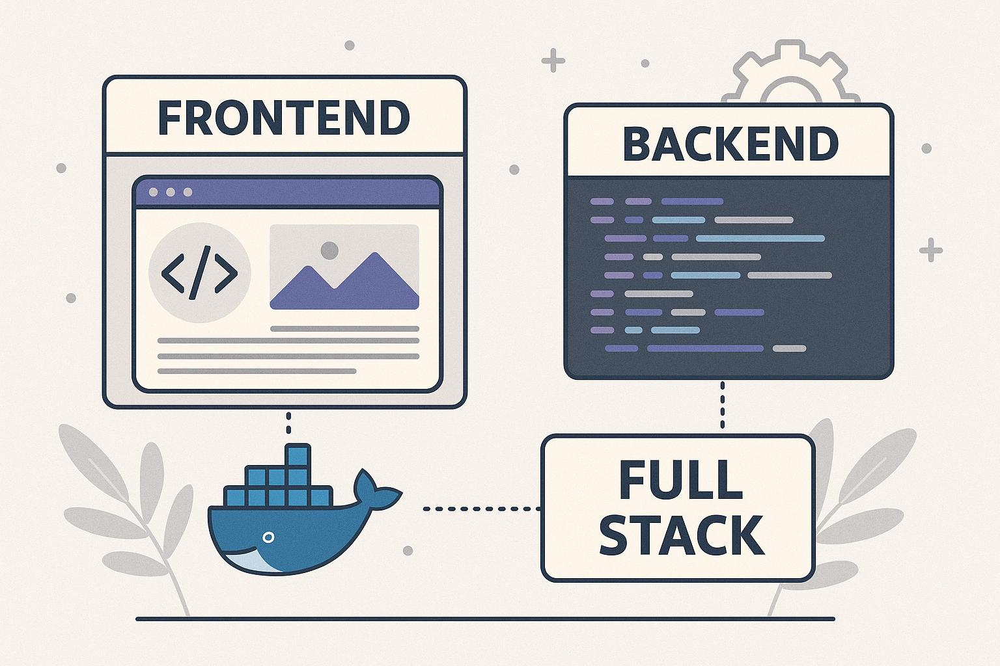
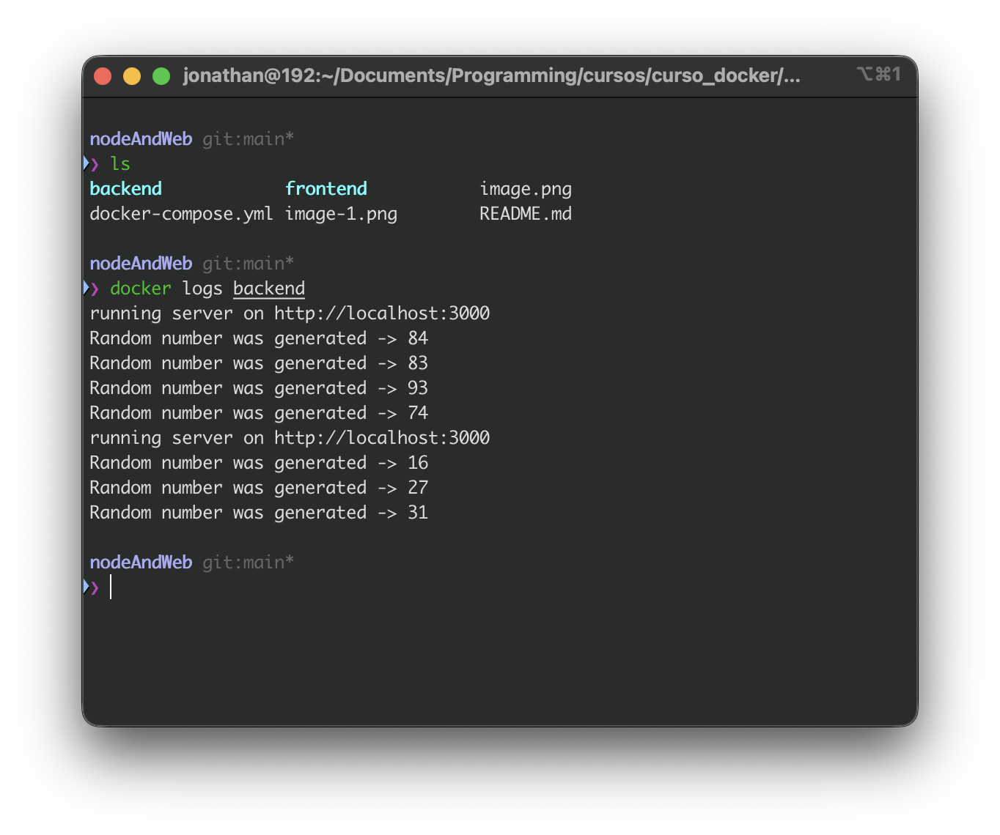
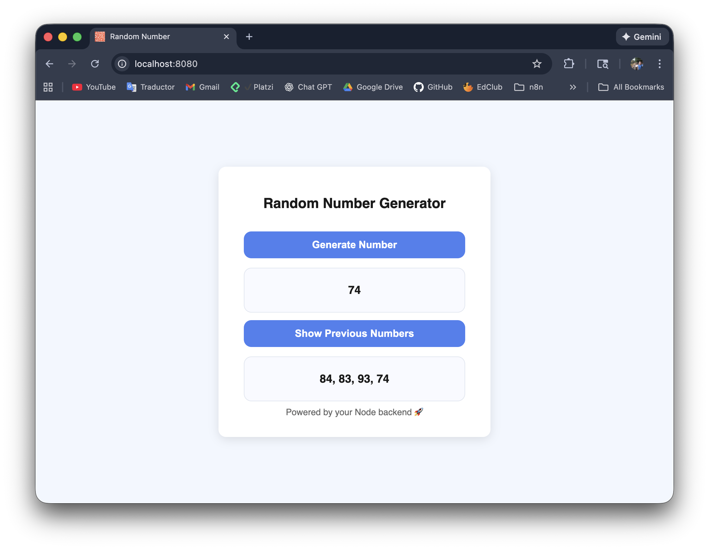

# docker-compose-fullstack-env



Full stack development environment using Docker Compose.  
It runs a **Node.js backend** and an **NGINX frontend** in separate containers that communicate through a custom Docker network.

This project was created as a practice setup to learn and reinforce Docker basics and service orchestration.  

If you want to explore the course that inspired this project, you can check it out here:  

https://platzi.com/cursos/docker-fundamentos/


---

## 📁 Repository Structure

This repository includes these main folders and files:

- **backend/** → Node.js server code and Dockerfile  
- **frontend/** → Web page and NGINX Dockerfile  
- **docker-compose.yml** → Controls and runs both services  
- **README.md**

Here is a simple explanation of what each folder contains.

---

## 💿 Backend (folder **backend/**)


### Main files:

- **index.js**  
  A small server that generates random numbers between 1 and 100. It can also return a list of all numbers generated before.

- **package.json**  
  Lists the server dependencies: `express` and `cors`.

- **Dockerfile**  
  Steps to build the backend image:
  - Uses **Node.js v25** as the base image  
  - Copies `package.json` into the container  
  - Installs dependencies with `npm install`  
  - Runs `index.js` with `node`  
  - Exposes port **3000**

### 🔗 Backend Endpoints

- Get a random number:  
  **http://localhost:3000/my-app/generateNumber**

- Get the list of generated numbers:  
  **http://localhost:3000/my-app/seeNumbers**

---

## 💿 Frontend (folder **frontend/**)


- **website/index.html**  
  Simple web page that communicates with the backend using `fetch`.

- **Dockerfile**  
  - Uses **nginx:1.28.0-alpine**  
  - Copies `index.html` to `/usr/share/nginx/html`  
  - Exposes port **8080**

To view the page:  
**http://localhost:8080/**

---

## 💿 docker-compose.yml

This file controls how both containers run and connect.

### 👉 Backend
- Builds the image using the backend Dockerfile  
- Image name: **node_backend:latest**  
- Exposes port **3000**  
- Connects to the `app_network` internal network

### 👉 Frontend
- Builds the image using the frontend Dockerfile  
- Image name: **nginx_frontend:latest**  
- Exposes ports `8080:80`  
- Uses the same `app_network`  
- Supports hot reload through this volume:  
  `./frontend/website → /usr/share/nginx/html`

---

## 🛠 Development Environment

You can edit both services:

- Backend → `backend/index.js`  
- Frontend → `frontend/website/index.html`

Frontend changes update instantly if you use hot reload.

---

## ☁️ Images on Docker Hub

- 📖 **Backend:** `miguezpz/node_server:latest`  
- 📖 **Frontend:** `miguezpz/website:latest`

---

## 🐳 Running the Images Without Docker Compose

If you want to run the containers manually, first create the shared network:

```bash
docker network create app_network
